# 基于 netfilter 的 Linux 系统防火墙

[toc]

## 功能完成

- [x] 用户层
- [x] 内核层
- [x] 通信
- [x] 规则过滤
- [x] 规则过滤 web 面板
- [x] 连接管理
- [x] 连接管理 web 面板
- [x] 状态防火墙
- [x] NAT
- [x] NAT web 面板
- [ ] 日志记录
- [ ] 日志审计 web 面板

## 立项意义

## 项目概要

### 整体架构

- Web 端控制面板

  > 使用数据库存储过滤规则表和 NAT 规则表等数据，使用 B/S 架构直接对防火墙行为进行控制

- 命令行管理工具

  > 可以使用提供的用户态的命令行工具进行防火墙的过滤规则和 NAT 规则的配置

- 内核驱动模块

  > 在内核基于 NETFILTER 实现包过滤、NAT 等功能


### 设计思路

1、**Node + MySQL**

> Web 控制面板使用用户程序提供的命令行管理语法实现便利的的 B/S 架构 UI

2、**用户态程序**

> 用户程序向下使用内核驱动模块提供的接口，向上为 web 控制面板提供防火墙管理接口

3、**NETLINK 套接字**

> 使用 NETLINK 套接字和自定义的协议实现用户空间与内核空间的数据交换

4、**NETFILTER 框架**

> 使用 NETFILTER 提供的底层接口编写相关的内核驱动模块

### 开发环境

- 操作系统：Linux 5.15.0-89-generic #99~20.04.1-Ubuntu SMP Thu Nov 2 15:16:47 UTC 2023 x86_64 x86_64 x86_64 GNU/Linux
- C 编译器：gcc (Ubuntu 9.4.0-1ubuntu1~20.04.2) 9.4.0
- 构建工具：GNU Make 4.2.1
- Node 运行环境：node v10.19.0
- 开发工具：visual studio code 1.85.0

## 详细设计

### 关键数据结构与变量

用户请求类型和结构体如下，tp 为请求的类型。

使用了 `union`关键字来定义结构体 `UsrReq`成员 `msg`。可以实现在相同的内存空间中节省存储空间，因为每次请求只需要一种数据，因此只需要存储其中一种类型的数据。

```c
// tp请求类型
#define REQ_GETAllFTRULES 1 // 获取所有过滤规则
#define REQ_ADDFTRULE 2     // 添加过滤规则
#define REQ_DELFTRULES 3    // 删除过滤规则
#define REQ_SETACT 4        // 设置行为
#define REQ_GETAllLOGS 5    // 获取所有日志
#define REQ_GETAllCONNS 6   // 获取所有网络连接
#define REQ_ADDNATRULE 7    // 添加网络地址转换规则
#define REQ_DELNATRULE 8    // 删除网络地址转换规则
#define REQ_GETNATRULES 9   // 获取所有网络地址转换规则

struct UsrReq
{
    unsigned int tp;
    char ruleName[MAXRuleNameLen + 1];
    // 请求体——过滤规则、NAT规则、默认动作
    union
    {
        struct FTRule FTRule;
        struct NATRule NATRule;
        unsigned int defaultAction;
        unsigned int num;
    } msg;
};
```

内核响应状态码和响应结构体如下，stat 为内核返回第状态码。data 存储返回时数据，header 指针指向 data 中的头部，body 指针指向 data 中的数据载荷。

```c
// stat
#define RSP_NULL 10
#define RSP_MSG 11
#define RSP_FTRULES 12  // body为过滤规则
#define RSP_FTLOGS 13   // body为日志
#define RSP_NATRULES 14 // body为nat规则
#define RSP_CONNLOGS 15 // body为连接

struct KernelResp
{
    int stat;
    void *data;
    struct KernelResHdr *header;
    void *body;
};
```

过滤规则的结构体如下，包括 rulename、源地址、目的地址、源端口、目的端口、协议、策略、是否记录日志几个参数。

```c
struct FTRule
{
    char name[MAXRuleNameLen + 1];
    unsigned int saddr;
    unsigned int smask;
    unsigned int taddr;
    unsigned int tmask;
    unsigned int sport;
    unsigned int tport;
    u_int8_t protocol;
    unsigned int act;
    unsigned int islog;
    struct FTRule *next;
};
```

NAT 规则结构体如下

```c
struct NATRule
{
    unsigned int saddr; // 源IP
    unsigned int smask; // 源IP的掩码
    unsigned int daddr; // 转换后的IP
    unsigned short sport;   // 原始端口
    unsigned short dport;   // 转换后的端口
    unsigned short nowPort; // 当前使用的端口
    struct NATRule *next;
};
```

连接会话的结构体如下

```C
struct connSess
{
    struct rb_node node;
    conn_key_t key;        // 连接标识符
    unsigned long expires; // 超时时间
    u_int8_t syn;          // 记录syn数
    u_int8_t rate;         // 记录数据包到达的速率
    u_int8_t protocol;     // 协议
    u_int8_t needLog;      // 是否记录日志
    struct NATRule nat;    // 该连接对应的NAT记录
    int natType;           // NAT 转换类型
};
```

过滤规则链表和过滤规则表的读写自旋锁如下。前者维护过滤规则表，后者可以保证规则表可以同时被多个进程读取但不能同时被多个进程写入，用于保证规则表并发安全。

```c
// 规则链表
static struct FTRule *FTRuleHd = NULL;
// 规则链表锁，保证并发安全
static DEFINE_RWLOCK(FTRuleLock);
```

NAT 规则表和 NAT 规则表的读写自旋锁。

```c
// NAT规则链表
static struct NATRule *NATRuleHd = NULL;
// NAT规则链表锁，保证并发安全
static DEFINE_RWLOCK(NATRuleLock);
```

利用红黑树存储连接会话。红黑树是一种自平衡的二叉搜索树，它可以高效地查找数据。由于对于连接会话来说，数据包到达的频率远远大于新连接建立的频率，因此使用红黑树存储连接会话，能够大大降低数据包到达时匹配连接会话的时间复杂度。

同理，connLock 为连接会话表的读写自旋锁。

> 为什么不用红黑树来存储过滤规则呢？这样不是更快吗？
>
> 在开发的时候也考虑过使用红黑树来存储过滤规则，但是后来考虑到过滤规则具有先后顺序，应该返回匹配到的第一条规则，那么红黑树就不是最合适的数据结构，如果为了提高效率而增加配置维护的难度和降低安全性，那就是舍本逐末了。因此不使用红黑树来存储过滤规则。

```c
// 红黑树和读写锁
static struct rb_root connRoot = RB_ROOT;
static DEFINE_RWLOCK(connLock);
```

下面的六个钩子点，分别用于

- 本地入站规则检查
- 本地出站规则检查
- 预路由阶段处理数据包，处理 DNAT
- 预路由阶段过滤数据包，建立 NAT 连接
- 后路由阶段处理数据包，处理 SNAT
- 后路由阶段过滤数据包，建立 NAT 连接

```c
static struct nf_hook_ops NF_HKLocalIn;
static struct nf_hook_ops NF_HKLocalOut;
static struct nf_hook_ops NF_HKPreRouting;
static struct nf_hook_ops NF_HKPreRouting2;
static struct nf_hook_ops NF_HKPostRouting;
static struct nf_hook_ops NF_HKPostRouting2;
```

对数据包的默认策略，这个变量定义了对未匹配到规则的数据包的默认策略。

```c
// 设置默认动作
unsigned int DEFAULT_ACTION = NF_ACCEPT;
```

下面的两个变量用于在内核创建一个 sock 套接字并配置 netlink 内核套接字的参数。创建一个 `netlink_kernel_cfg`结构体变量，配置 netlink 内核套接字的行为和回调函数。

```c
// 创建一个套接字结构
static struct sock *nl_sock = NULL;

struct netlink_kernel_cfg nl_conf = {
    .groups = 0,
    .flags = 0,
    // 指定了一个回调函数NLFWRecv，用于在接收到 netlink 消息时进行处理
    // void (*input)(struct sk_buff *skb);
    .input = NLFWRecv,
    .cb_mutex = NULL,
    .bind = NULL,
    .unbind = NULL,
    .compare = NULL,
};
```

### NETLINK

> 使用 NETLINK 套接字实现用户空间与内核空间的数据交换。

整体通信的流程如下所示。

用户空间与内核空间的通信通过 Netlink Socket 实现，在此之上自定义一套数据交换协议。使用 sendto()函数向内核发送消息，recvmsg()函数从内核接收消息。在内核与用户空间中对请求与响应进行解析。协议的请求格式和相应格式见先前的关键数据结构与变量部分。


通过 netlink 完成用户空间与内核空间的通信，实现过滤规则的添加、删除、查看，默认策略的设置，连接会话表的检查，NAT 规则的添加、查看与删除等操作，能够在用户空间管理内核驱动程序。

### NETFILTER

> 本项目拟利用 netfilter 提供的底层的**hook 点**，在此之上实现**内核防火墙驱动模块**和**用户空间的防火墙控制程序**。

定义了多个 Netfilter 钩子（hook）和对应的回调函数。每个钩子都有一个钩子号（hooknum）、协议族（pf）和优先级（priority）。


**入站（NF_INET_LOCAL_IN）：**

- `NF_HKLocalIn`：钩子号为入站（NF_INET_LOCAL_IN），回调函数为 `NfHookLocalIn`，优先级为最高（`NF_IP_PRI_FIRST`）。主要实现出站数据包的过滤。

**出站（NF_INET_LOCAL_OUT）：**

- `NF_HKLocalOut`：钩子号为出站（NF_INET_LOCAL_OUT），回调函数为 `NfHookLocalOut`，优先级为最高（`NF_IP_PRI_FIRST`）。主要实现入站数据包的过滤。

**预路由（NF_INET_PRE_ROUTING）：**

- nat 链：
  - `NF_HKPreRouting`：钩子号为预路由（NF_INET_PRE_ROUTING），回调函数为 `NfHookPreRouting`，优先级为目标地址转换（`NF_IP_PRI_NAT_DST`）。主要实现 DNAT。
- filter 表：
  - `NF_HKPreRouting2`：钩子号为预路由（NF_INET_PRE_ROUTING），回调函数为 `NfHookLocalIn`，优先级为最高（`NF_IP_PRI_FIRST`）。主要实现对需要转发的数据包的过滤，如果是从内网到互联网的数据包，则根据过滤规则进行放行（放行时根据 NAT 记录添加正向连接会话和反向连接会话）或者丢弃，如果是从互联网到内网的数据包，则检查连接会话表决定是否转发。

**后路由（NF_INET_POST_ROUTING）：**

- nat 链：
  - `NF_HKPostRouting`：钩子号为后路由（NF_INET_POST_ROUTING），回调函数为 `NfHookPostRouting`，优先级为源地址转换（`NF_IP_PRI_NAT_SRC`）。主要实现 SNAT。
- filter 表：
  - `NF_HKPostRouting2`：钩子号为后路由（NF_INET_POST_ROUTING），回调函数为 `NfHookLocalIn`，优先级为最高（`NF_IP_PRI_FIRST`）。主要实现对需要转发的数据包的过滤，与预路由阶段的 filter 表同理。

### 包过滤

> 根据特定的过滤规则对网络数据包进行筛选和处理。通过包过滤，可以控制网络流量，允许或阻止特定类型的数据包通过网络设备。

防火墙程序在内核进程中维护一个包过滤的规则链表。每个元素包含五元组和其他信息——源 IP、目的 IP、源端口、目的端口、协议类型以及对报文的操作。用户空间程序可以通过之前提到的 netlink 套接字对这个规则链表进行维护。

在数据包出站与入站时首先在连接会话表中查询是否存在对应的连接会话，如果存在则直接放行。如果没有找到连接会话，则遍历规则链表，并与数据包进行匹配，然后对出入站数据包执行放行与丢弃的操作，如果策略为放行，则在连接会话表中插入一条新的连接。（关于连接状态的实现在后文描述）

整体的流程图如下所示。


### 连接状态

> 在内核维护一个连接会话表，为每一个第一次通过的数据包插入一条连接会话项，这样当数据包到达时，就能够先检查会话表，而不需要每次都遍历规则表，大大节省了时间。
>
> 由于对于连接会话来说，数据包到达的频率远远大于新连接建立的频率，因此使用红黑树存储连接会话，能够大大降低数据包到达时匹配连接会话的时间复杂度。

连接表的检查流程如下所示。如果数据包到达，则更新这条连接的超时时间。对于连接会话表，首先初始化一个定时器，定时器注册一个回调函数，实现一段时间后清理超时的连接会话。为了让这个过程能一直持续下去，可以在计时器回调函数中重新激活定时器，这样就实现了每隔 CONN_ROLL_INTERVAL 时间调用一次 rollConn 函数。


#### 状态防火墙的优点

1. 提高性能：状态防火墙使用会话表来跟踪网络连接的状态，这样可以避免对每个数据包都进行完整的规则匹配和处理。通过使用会话表，防火墙可以快速检查数据包是否属于一个已经建立的连接，并直接放行它们，从而提高了整体的处理性能和吞吐量。
2. 减少资源消耗：传统的防火墙在处理每个数据包时都需要进行完整的规则匹配，这会消耗大量的 CPU 和内存资源。状态防火墙通过跟踪连接状态，只对新的连接进行规则匹配，而对于已建立的连接则直接放行，从而减少了资源的消耗。
3. 支持复杂的规则：状态防火墙可以根据会话表中的连接状态和相关信息，灵活地应用复杂的规则。它可以基于连接的源地址、目的地址、端口号等信息进行更精确的规则匹配和策略应用，从而提供更高级的网络访问控制和安全性。
4. 减少误报：由于状态防火墙可以根据连接状态来放行合法的数据包，它能够减少误报的可能性。当一个连接已经建立并通过防火墙验证，后续的数据包将直接通过，而不会被错误地拦截或标记为潜在的威胁。

### NAT 网络地址转换

> 当内网主机访问互联网时，会建立两个连接会话 A->C 和 C->B，这两条会话都有对应的 NAT 记录，进入互联网的数据包首先在预路由的 filter 链阶段进行连接会话匹配和过滤规则匹配，放行则添加连接会话 A->C。在后路由 nat 阶段匹配连接会话 A->C 的 NAT 规则，修改源地址（如果是初次进入则会在后路由的 filter 链阶段添加反向的连接会话 C->B 并创建对应的 NAT 规则）然后发送到互联网。从互联网进入内网的数据包先在预路由 filter 链阶段检查是否存在连接会话和过滤规则匹配，如果存在则在预路由 nat 阶段根据连接会话 C->B 的 NAT 记录修改目的地址，并进行转发。

数据包从内网发送到互联网的网络地址转换流程如下所示。首先在预路由阶段匹配过滤规则，如果可以通过或者存在连接会话则放行，然后在预路由 nat 阶段不进行处理，经过转发进入后路由阶段。在 filter 链添加反向的 NAT 连接（如果不存在的话），之后在后路由 nat 阶段对数据包进行处理，修改源 IP 和源端口号等数据，实现 SNAT。


数据包从互联网发送到内网的网络地址转换流程如下所示。从互联网进入的数据包首先经过预路由的 filter 链，检查连接会话表，如果存在连接则放行，不存在则检查规则表，如果允许通过则添加一条连接会话。放行之后进入预路由 nat 阶段，在这里根据会话表或者存在的关于目的地的 NAT 规则修改数据包的目的地址和目的端口，实现 DNAT，然后经过转发和后路由 filter 链阶段，在后路由 nat 阶段检查连接会话表查看是否存在反向连接，不存在则添加一条反向连接，实现 DNAT。


### web 管理面板

#### 数据库设计

数据库名:**db_firewall**

共建立了 4 个表：

**一、** **t_act** **：该表用于存储对数据包入站和 NAT 过程的默认策略，包含以下列：**

create_time：日期时间类型的列，表示创建时间。

act：整数类型的列，表示动作。

index：字符串类型的列，表示索引。

**二、** **t_filter_rules** **：该表用于存储过滤规则信息，包含以下列：**

id：整数类型的列，作为主键。

create_time：日期时间类型的列，表示创建时间。

name：字符串类型的列，表示名称。

src_ip：字符串类型的列，表示源 IP。

dst_ip：字符串类型的列，表示目标 IP。

src_port：字符串类型的列，表示源端口。

dst_port：字符串类型的列，表示目标端口。

protocol：字符串类型的列，表示协议。

act：字符串类型的列，表示规则的放行策略。

**三、** **t_nat_rules** **：该表用于存储网络地址转换规则信息，包含以下列：**

id：整数类型的列，作为主键。

create_time：日期时间类型的列，表示创建时间。

seq：整数类型的列，表示序列。

bf_ip：字符串类型的列，表示源 IP。

af_ip：字符串类型的列，表示目标 IP。

min_port：整数类型的列，表示转发的端口范围最小值。

max_port：整数类型的列，表示转发的端口范围最大值。

**四、** **t_users** **：该表用于存储用户信息，包含以下列：**

id：整数类型的列，作为主键。

create_time：日期时间类型的列，表示创建时间。

username：字符串类型的列，表示用户名。

password：字符串类型的列，表示 SHA1 之后的密码。

email：字符串类型的列，表示电子邮件。

#### 后台接口编写

## 项目测试

### web 面板基础功能

登陆界面


过滤规则之默认策略展示与修改页面

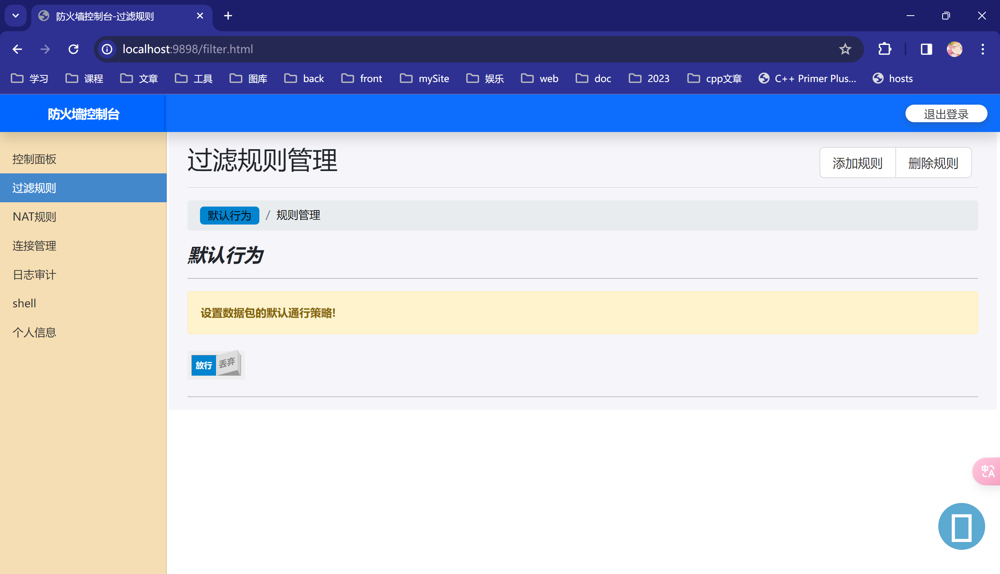

过滤规则之规则管理页面，可以实现规则的增删查

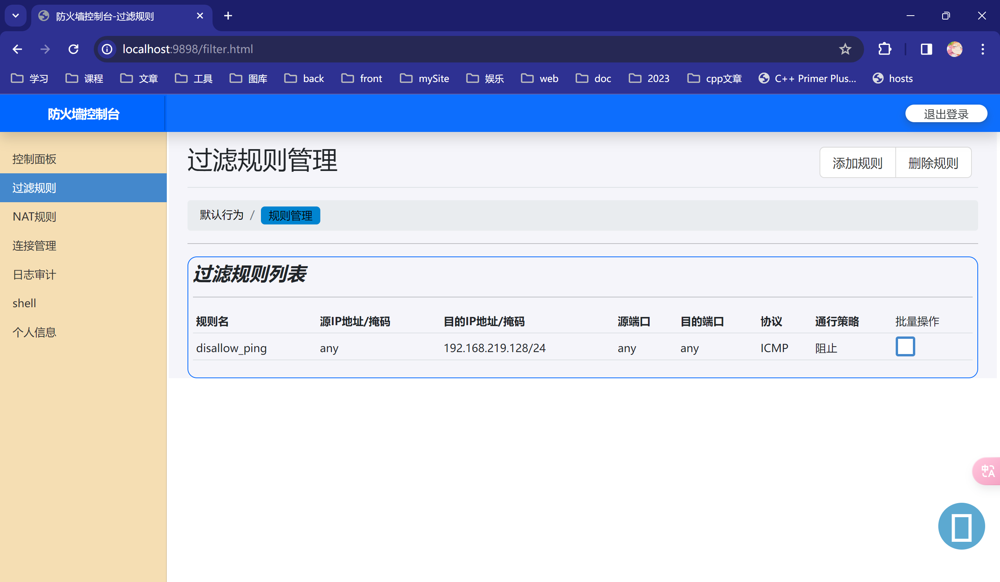

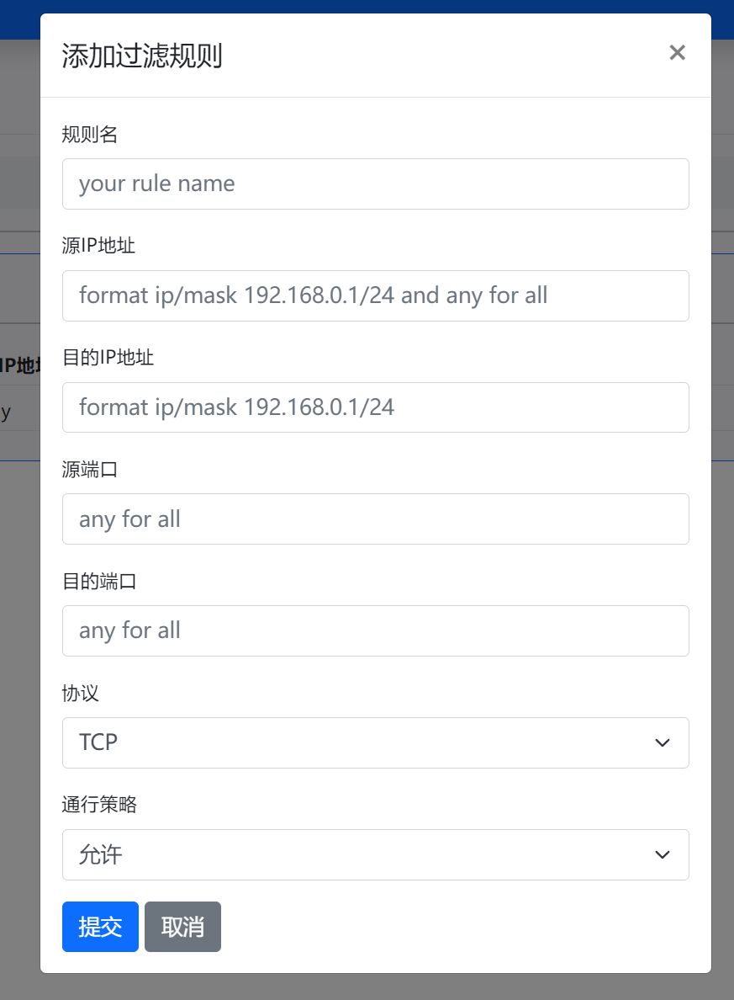

NAT 规则管理页面，可以实现 NAT 记录的增删查

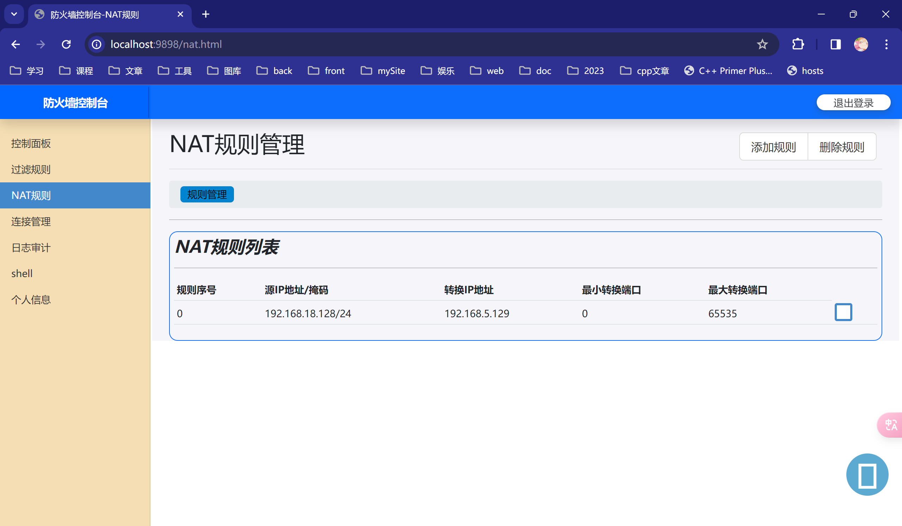

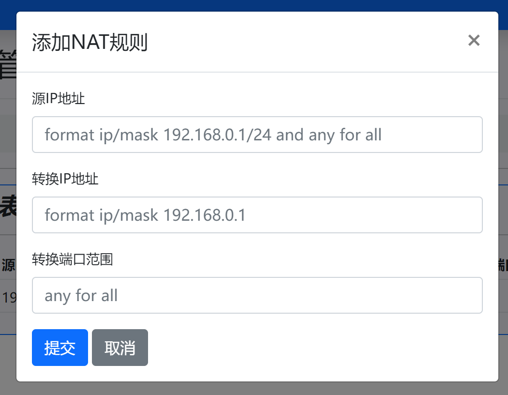

连接状态页面，可以实时查看防火墙当前建立的连接。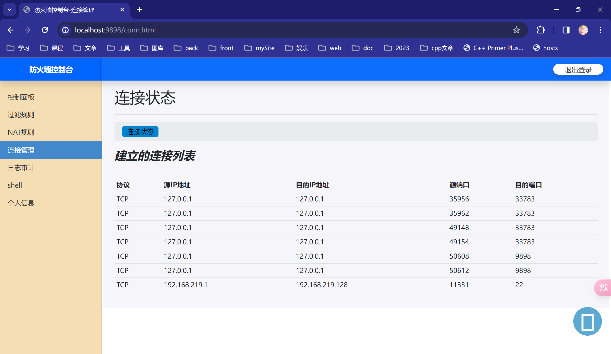

### 包过滤功能

#### 测试一 禁用 ping

首先，主机能够正常 ping 到防火墙主机

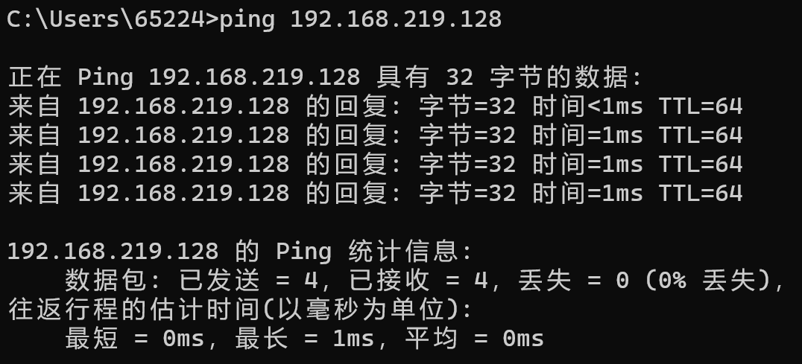

然后添加一条规则禁止任何主机 ping 防火墙，如下

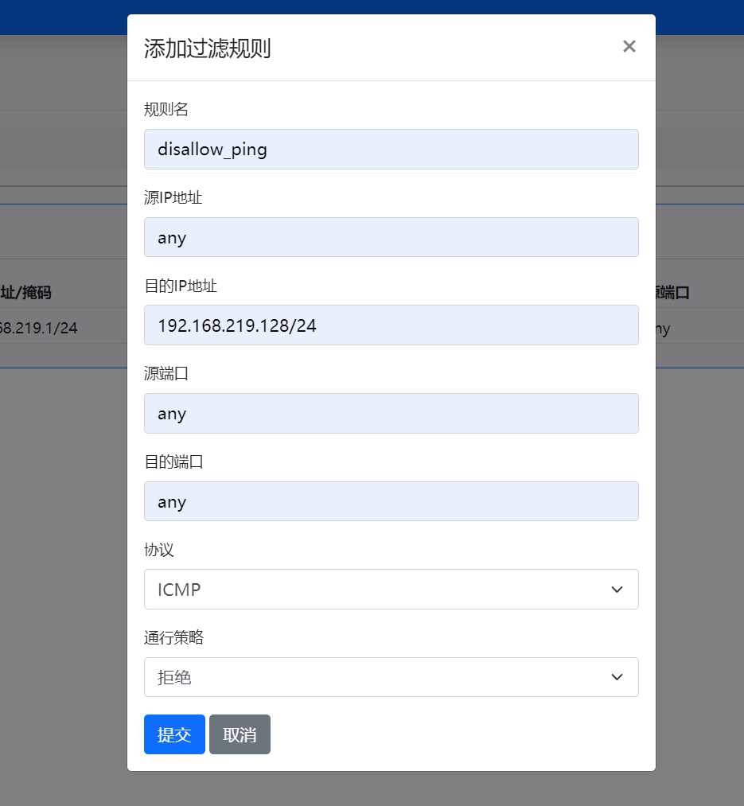

之后主机无法 ping 通防火墙了

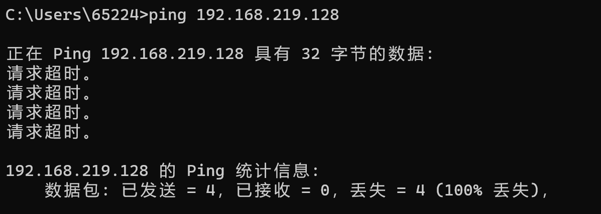

#### 测试二 允许访问 web 服务

使用 namp 扫描防火墙主机，可以看到开启了 22 端口。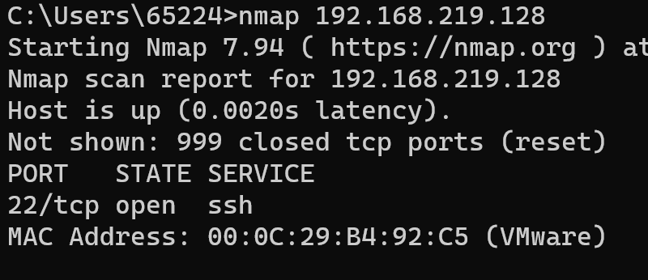

将默认规则设为拒绝


然后使用 nmap 扫描，发现没有扫描到开启端口。扫描不到开启的 9898 端口（也就是防火墙 web 面板运行的端口），是因为这时的数据包放行是通过连接会话放行的，在设置默认策略为拒绝之前已经建立了一条 TCP 连接，因此浏览器可以通过这个连接访问面板，但是 nmap 无法扫描到此端口。

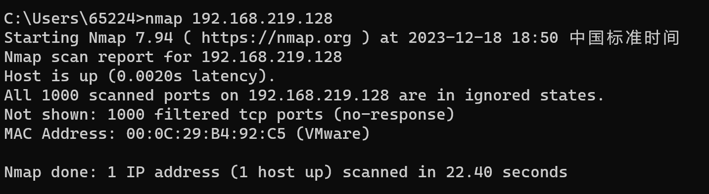

如图，添加一条规则允许访问防火墙主机开启的 HTTP 服务。

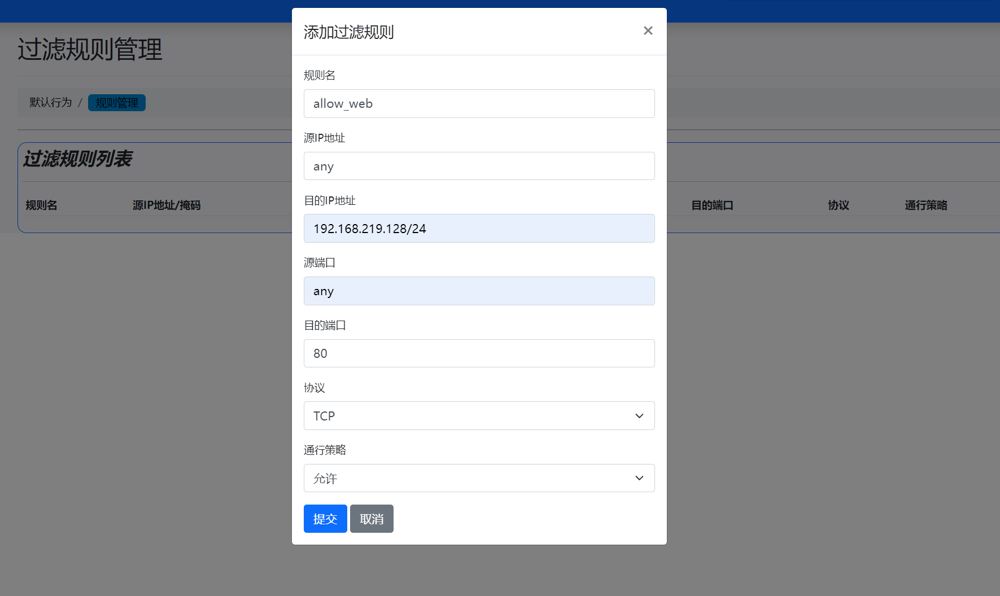

然后能够正常访问 web 服务，如下。

而且使用 nmap 扫描也能够扫描到开启的 80 端口的 web 服务。（这里我们也没有弄明白，为什么能够扫描到 9898 端口呢？）

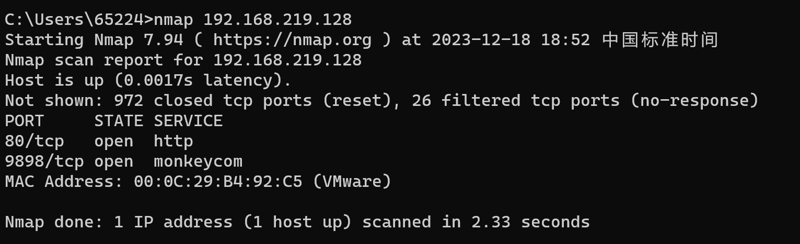

### 状态防火墙

关于实现的状态防火墙功能前面已经有过介绍了，就是先匹配会话表里的连接再来进行包过滤。同理，在默认策略为拒绝的状态下进行测试。

#### 访问百度网站

访问前的连接会话表

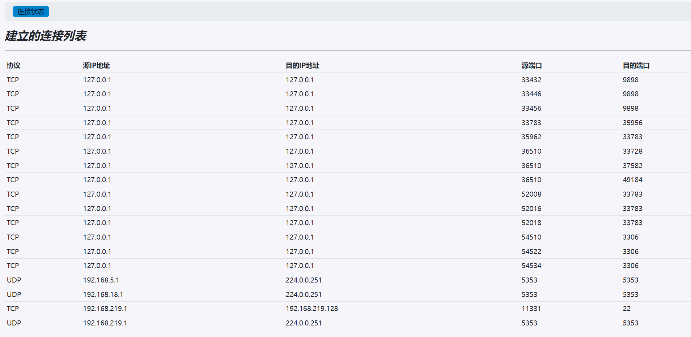

访问 `https://www.baidu.com`，虽然我们把默认出站规则设置为了拒绝，但是依然能够正常与百度的服务器建立连接，并接收从百度来的数据包。这是因为当我们内部的数据包通过时，防火墙就会根据数据包的源和目的地址与端口在会话表中添加一条记录，然后当百度服务器的数据包到达时，就会首先检查连接会话表，检查到会话表就会直接放行而不需要继续检查规则表或者应用默认策略了。

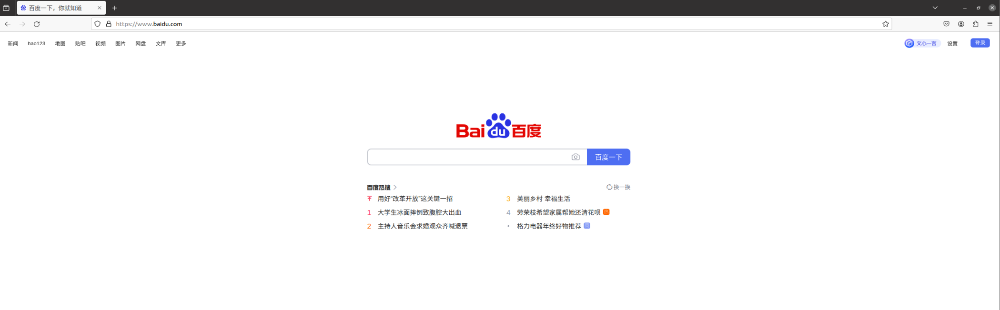

访问百度之后的会话表，可以看到多了很多条到公网 IP 的 443 端口的连接，这说明与使用了 HTTPS 的网站服务器建立了连接，能推测是百度的服务器。

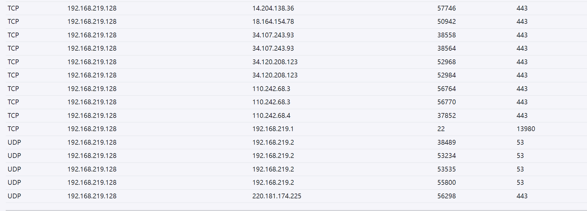

### NAT 功能

#### 网络拓扑环境的配置

克隆两台 ubuntu20.04，通过 vmware 配置网络接口模拟内外网环境，并设置内网主机 192.168.18.128 的默认网关为防火墙主机。

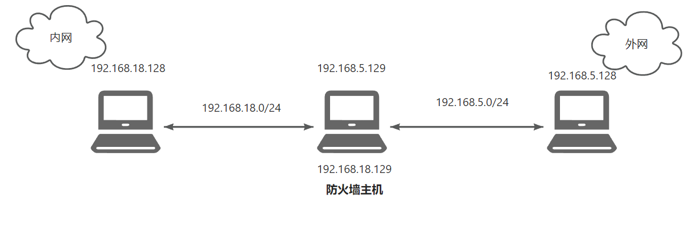

检查防火墙的转发功能是否开启。

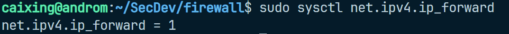

内网主机是暂时无法 ping 通外网主机的。

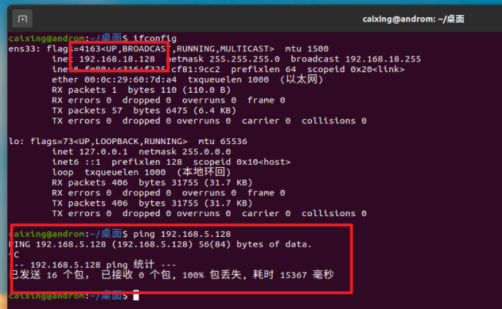

#### 添加 NAT 规则

添加一条 NAT 规则，内网的主机 192.168.18.128 的任意端口进行转发，转换后的 IP 地址为 192.168.5.129，转换后内网主机就能够访问外网主机 192.168.5.128 了。

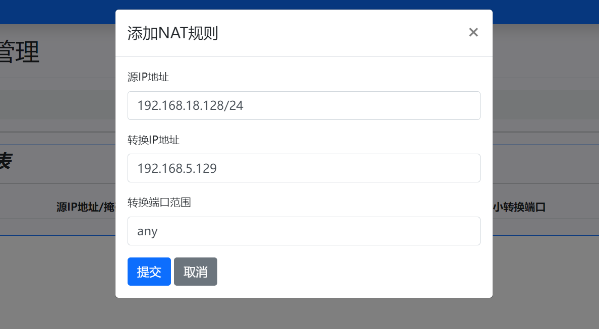

#### 内网主机访问外网

接下来内网主机就能够 ping 通在外网的主机了，如下。

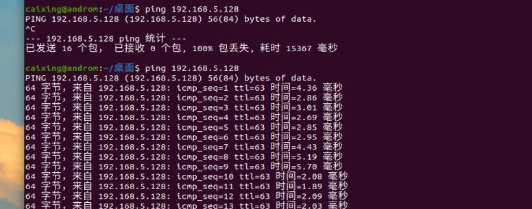

并且在外网主机开启 wireshark 检查 ICMP 数据包，显示 ICMP Request 来自 192.168.5.129，ICMP Echo 去往 192.168.5.129，这是转换后的 IP 地址，说明实现了网络地址转换。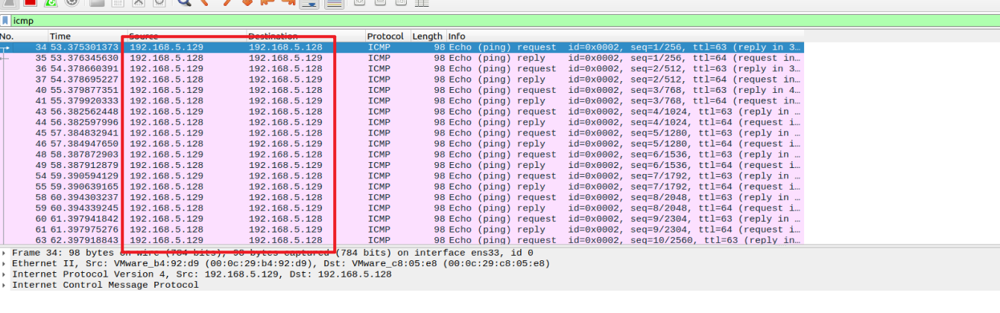

#### 检查连接会话表

检查连接会话表，发现添加了两条 ICMP 协议的连接，`从真正的源主机 192.168.18.128 到真正的目的主机 192.168.5.128 `的正向连接和 `从外网主机 192.168.5.128 到防火墙 192.168.5.129 的反向连接`。

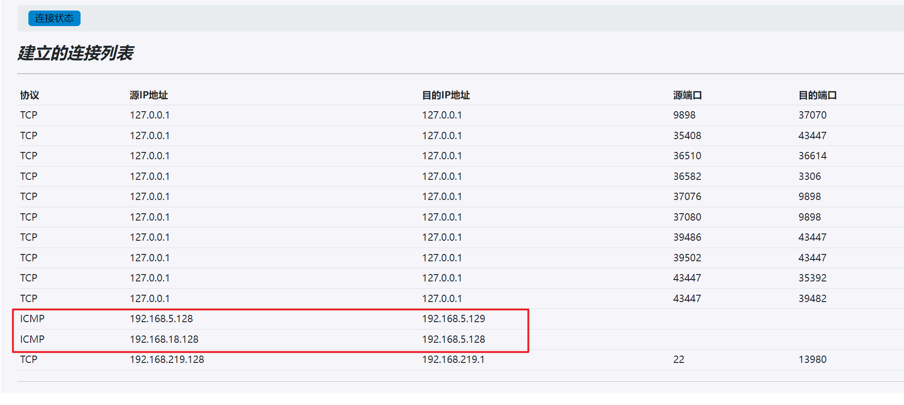

## 心得体会
