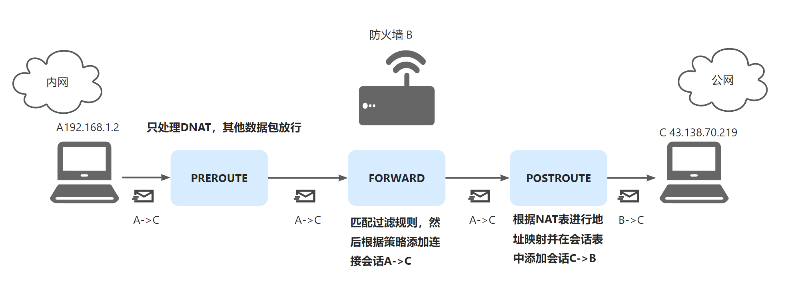
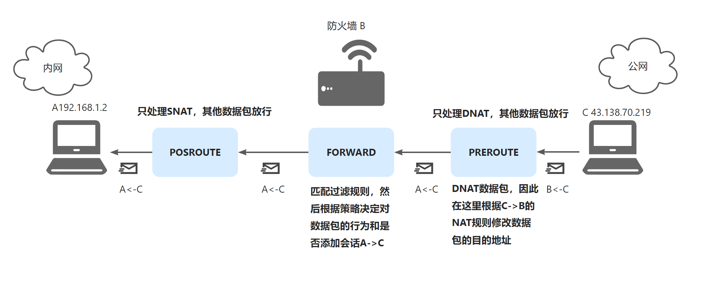
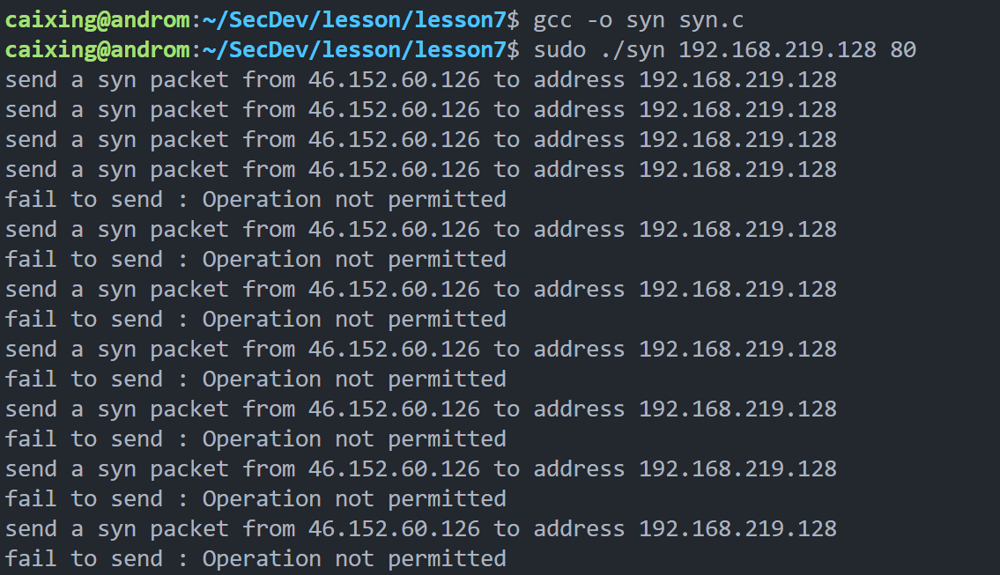

- [X] 用户层
- [X] 内核层
- [X] 通信
- [X] 规则过滤
- [X] 规则过滤 web 面板
- [X] 连接管理
- [X] 连接管理 web 面板
- [X] 状态防火墙
- [X] NAT
- [ ] NAT web 面板
- [ ] 日志记录
- [ ] 日志审计 web 面板
- [X] 基础 DOS 防御——预防 SYN Flood
- [X] 基础 DOS 防御——限制单个连接的数据包到达速率
- [ ] 远程登录 web 面板

# 用户层

# 内核层

# NETLINK

# NETFILTER

# web 控制后台

## 包过滤

## 连接状态

## NAT 网络地址转换

> 当内网主机访问互联网时，会建立两个连接会话A->C和C->B，这两条会话都有对应的NAT记录，进入互联网的数据包首先进行过滤，放行则添加连接会话A->C。在后路由阶段匹配连接会话A->C的NAT规则，修改源地址（如果是初次进入则会添加反向的连接会话C->B并创建对应的NAT规则）然后发送到互联网。从互联网进入内网的数据包先在预路由阶段检查是否存在连接会话，如果存在则根据连接会话C->B的NAT记录修改目的地址，并进行转发。
>
> 预路由阶段只处理DNAT，后路由阶段只处理SNAT。

SNAT流程如下所示



DNAT流程如下所示



# DoS 防御

> 大部分情况下，这样的防御方式只能说是小孩子过家家，根本招架不住正经的 DoS 或者 DDoS。所以这里的功能实现仅仅用于学习和巩固。

## SYN Flood

限制了来自单个 IP 的 SYN 数据包数量



## 流量限制

限制了来自单个 IP 的数据包到达速率

```C
needDel = rb_entry(node, struct connSess, node);
if (isTimeout(needDel->expires) || needDel->rate > MAX_RATE)
{
    // 删除
    if (needDel->rate > MAX_RATE)
    {
        ban_ip(needDel->key[0]);
    }
    hasChange = 1;
    break;
}
```
